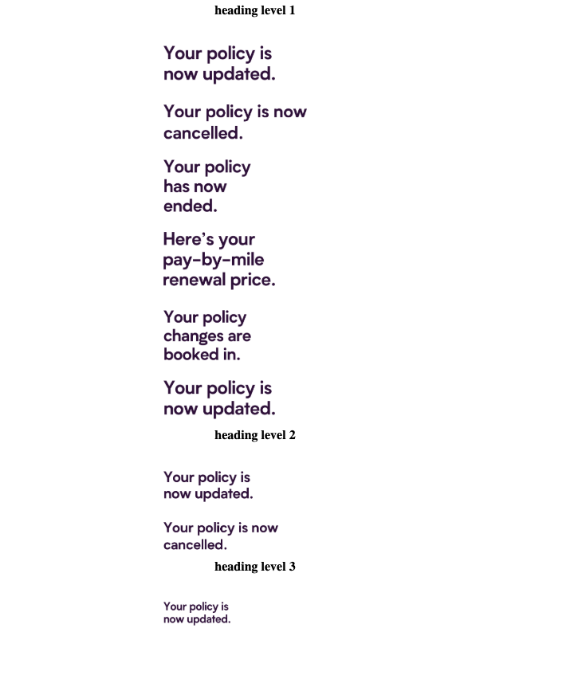

Upload images and the function will resize it for you to fit emails perfectly. 

1. `npm run start` to start the app
2. Select the heading size you are after (h1, h2, h3)
3. Upload the heading image that you want resized
4. Open the console and it will print the necessary html tags with the correct image aspect ratio
5. copy the log and paste into ypur email template

How does it work?

1. once you have uplaoded an image it creates a temp image which it uses get the raw width and height
2. we use Tesseract.js to "read" the image and create a string.  
3. split the text by `line-break` this will return an array containg each line of the image `['your policy', 'is now', cancelled]`
4. use reduce to find the longes line in length.
5. times the length by the selected font size. in the example above the longest line is `your policy` which contains 11 characters (including spaces) so 11 * `font-size` = new width of image.
6. use the new width to calculate the correct height that has the correct aspect ratio
7. return html that can be copied and pasted into the email tempalte (includes alt text that will be the file name)

some screenshots:

